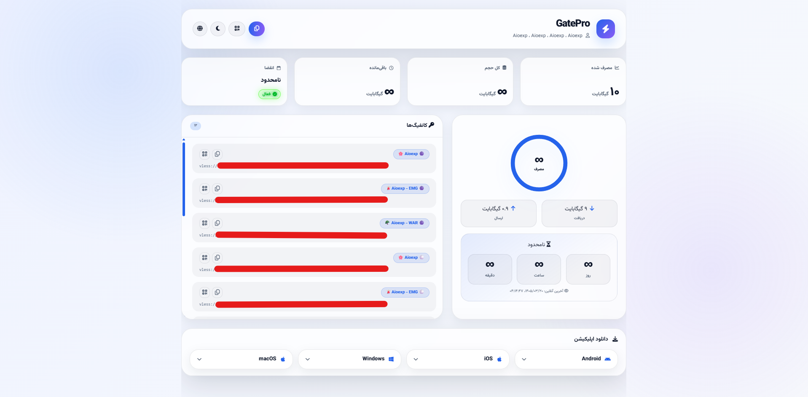

# 🚀 AioSubX3

Modern custom subscription page for **3x-ui v3.3.0+**

**AioSubX3** یک صفحه ساب کاستوم، مدرن، ریسپانسیو و دو زبانه برای پنل **3x-ui** است که برای نسخه‌های **3.3.0 به بعد** آماده شده است.

## 🖼️ Preview

### 🌙 Dark Mode


### ☀️ Light Mode




## ✨ Features

* 🎨 طراحی مدرن و ریسپانسیو
* 📱 مناسب موبایل، تبلت و دسکتاپ
* 🌐 پشتیبانی از زبان فارسی و انگلیسی
* 🌙 پشتیبانی از حالت تاریک و روشن
* 📊 نمایش حجم مصرف‌شده، حجم کل و حجم باقی‌مانده
* 🔵 نمایش درصد مصرف
* ⏳ نمایش زمان باقی‌مانده اشتراک
* ✅ نمایش وضعیت فعال یا غیرفعال بودن کاربر
* 👁️ نمایش آخرین زمان آنلاین بودن کاربر
* 🔑 نمایش کانفیگ‌ها به‌صورت لیست
* 📋 امکان کپی لینک اشتراک و کانفیگ‌ها
* 🔳 امکان نمایش QR Code برای لینک اشتراک و هر کانفیگ
* 📦 نمایش برنامه‌های پیشنهادی برای Android، iOS، Windows و macOS
* ⚡ سازگار با **3x-ui v3.3.0+**

---

## ⚡ Quick Install

برای نصب سریع AioSubX3 روی سرور، دستور زیر را اجرا کنید:

```bash
bash <(curl -fsSL https://raw.githubusercontent.com/monhacer/AioSubX3/refs/heads/main/install.sh)
```

بعد از اجرا، فایل صفحه ساب در مسیر زیر قرار می‌گیرد:

```bash
/etc/x-ui/sub/sub.html
```

---

## 🛠️ Manual Install

اگر می‌خواهید نصب را دستی انجام دهید، دستورهای زیر را اجرا کنید:

```bash
mkdir -p /etc/x-ui/sub
curl -fsSL https://raw.githubusercontent.com/monhacer/AioSubX3/main/sub.html -o /etc/x-ui/sub/sub.html
chmod 644 /etc/x-ui/sub/sub.html
```

---

## 🔄 Update

برای بروزرسانی AioSubX3، دوباره دستور نصب سریع را اجرا کنید:

```bash
bash <(curl -fsSL https://raw.githubusercontent.com/monhacer/AioSubX3/main/install.sh)
```

---

## 🔍 Check Installation

برای بررسی نصب موفق:

```bash
ls -lah /etc/x-ui/sub/sub.html
```

برای مشاهده چند خط اول فایل:

```bash
head -n 5 /etc/x-ui/sub/sub.html
```

---

## ♻️ Restart 3x-ui

بعد از نصب، در صورت نیاز پنل 3x-ui را ری‌استارت کنید:

```bash
x-ui restart
```

یا:

```bash
systemctl restart x-ui
```

---

## 📁 Repository Structure

```text
AioSubX3/
├── README.md
├── install.sh
├── sub.html
└── LICENSE
```

---

## 📝 Notes

* ⚠️ این پروژه فقط فایل صفحه ساب را جایگزین می‌کند.
* 🔒 تنظیمات اصلی پنل 3x-ui را تغییر نمی‌دهد.
* ✅ قبل از نصب، مطمئن شوید 3x-ui روی سرور نصب و فعال است.
* 💾 اگر قبلاً فایل `sub.html` اختصاصی داشته‌اید، بهتر است قبل از نصب از آن بکاپ بگیرید.

برای بکاپ گرفتن:

```bash
cp /etc/x-ui/sub/sub.html /etc/x-ui/sub/sub.html.bak
```

---

## 🗑️ Uninstall

برای حذف AioSubX3:

```bash
rm -f /etc/x-ui/sub/sub.html
```

اگر بکاپ دارید، می‌توانید آن را برگردانید:

```bash
mv /etc/x-ui/sub/sub.html.bak /etc/x-ui/sub/sub.html
```

---

## ✅ Compatibility

```text
3x-ui v3.3.0+
```

---

## 📄 License

This project is licensed under the MIT License.
